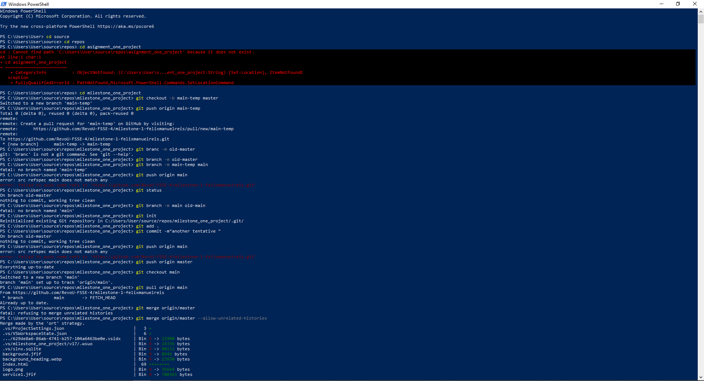
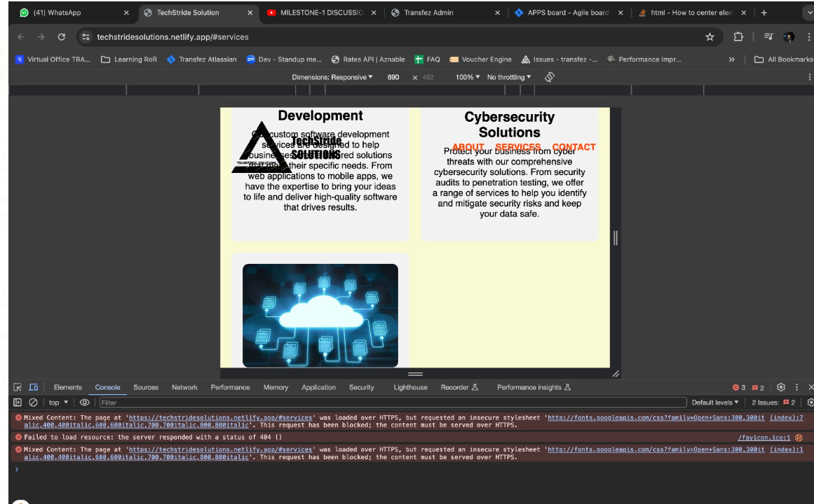
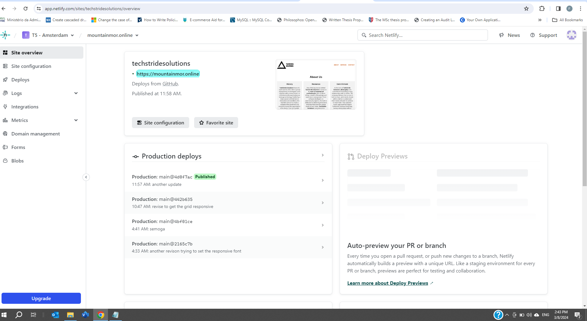

# TechStride Solutions Website Development Process

This document explains the development process of the TechStride Solutions website.

## Description

TechStride Solutions is a website that offers various technology-related services, including web development, software development, and digital marketing. The website aims to provide a seamless user experience, showcase the company's portfolio, and encourage potential clients to request a quote or get in touch for more information.

## Tech Stack

The TechStack used in this project includes:

- HTML5
- CSS3
- Git & GitHub

## Design

The website features a clean and modern design, with a focus on simplicity and ease of use. The color scheme consists of shades of gray and white, with clear call-to-action buttons and intuitive navigation.

## Process Showcase

- Design the tamplate for the website using HTML and CSS for basic styles 
- Adding the content and features to the web.
- Commit and push it to the local repository using Git (PowerShell) 
- Tentative deployment to netlify 
- Receiving feedback for improvement, this include improving the grids responsivenes ![feedback.PNG]
- Adding additional features such as the **animation** and **responsive navbar**.
- Deploy the project using custom domain .

## Features

- Responsive design, optimized for desktop, tablet, and mobile devices
- Clear and concise information about the company's services
- Describe the history, commitment and the dedicated professional team of the company.
- A contact link for potential clients to request a quote or get in touch. 

## How to Run the Project

To run the project locally, follow these steps:

1. Clone the repository to your local machine using `git clone https://github.com/RevoU-FSSE-4/milestone-1-felixmanuelreis.git`
2. Navigate to the project directory using `cd milestone_one_project`
3. Install the dependencies using `npm install`(To be completed) 
4. Run the project using `gulp serve` (To be completed) 

The website is also deployed on Netlify, and can be accessed at [https://mountainmor.online/](https://mountainmor.online/)
## License

This project is licensed under the MIT License.

## Contributing

Contributions are what make the open-source community such an amazing place to learn, inspire, and create. Any contributions you make are greatly appreciated.

1. Fork the Project
2. Create your Feature Branch (`git checkout -b feature/AmazingFeature`)
3. Commit your Changes (`git commit -m 'Add some AmazingFeature'`)
4. Push to the Branch (`git push origin feature/AmazingFeature`)
5. Open a Pull Request